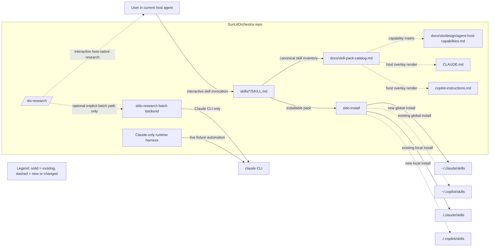

# Agent-Host Compatibility Cleanup — SunLitOrchestra (AI-First Runbook v3)

> **Purpose**: Make the SLO skill pack work cleanly in multiple skill-capable coding agents, starting with Claude Code and GitHub Copilot, by removing hidden Claude-only assumptions from installation, living docs, interactive skill flows, and test harness naming while preserving existing skill names and artifact contracts. Treat open-source user documentation as a first-class deliverable: README and getting-started usage docs must be as intentional and testable as the code.  
> **Audience**: AI coding agents first, humans second. This document is written to reduce ambiguity, prevent scope drift, and keep the portability work honest about what is truly host-neutral versus what remains Claude-only batch automation.  
> **How to use**: Work through milestones sequentially. Before starting any milestone, read its full section and the Global Execution Rules. After completing it, follow the Global Exit Rules. Never skip ahead. Never silently widen scope.  
> **Prerequisite reading**: [README.md](../README.md), [CLAUDE.md](../CLAUDE.md), [ARCHITECTURE.md](ARCHITECTURE.md), [skill-pack-catalog.md](skill-pack-catalog.md), [skills/README.md](../skills/README.md)

---

## Runbook Metadata

- **Runbook ID**: `agent-host-compat`
- **Prefix for test files and lessons files**: `agent-host`
- **Primary stack**: Markdown `SKILL.md` files + Rust 2021 workspace (`sldo-install`, `sldo-common`, `sldo-research`) + Rust structural/E2E tests
- **Primary package/app names**: `skills/`, `sldo-install`, `sldo-common`, `sldo-research`
- **Default test commands**:
  - Backend: `cargo test -p sldo-common -p sldo-install -p sldo-research`
  - Frontend: `N/A — no frontend surface in scope`
  - E2E backend: `cargo test -p sldo-install --tests`
  - E2E frontend: `N/A — no frontend surface in scope`
  - Build/boot: `cargo build -p sldo-install -p sldo-research`
- **Allowed new dependencies by default**: `none`
- **Schema/config migration allowed by default**: `no`
- **Public interfaces that must remain stable unless explicitly listed otherwise**:
  - `skills/<name>/SKILL.md` layout with `name` and `description` frontmatter
  - Existing skill names (`/slo-*` and `get-api-docs`)
  - `sldo-install` subcommands: `install`, `uninstall`, `status`, `verify`
  - Default no-arg `sldo-install` behavior targeting Claude Code for backward compatibility
  - `references/biz/` and `references/sast/` as repo-root shared scaffolding directories
  - Existing artifact paths written by skills (for example `docs/slo/idea/<slug>.md`, `docs/slo/research/<slug>/`, `docs/biz/`, `docs/biz-public/`)

---

## Milestone Tracker

Update this table as each milestone is completed. This is the single source of truth for progress.

| # | Milestone | Status | Started | Completed | Lessons File | Completion Summary |
|---|---|---|---|---|---|---|
| 1 | Installer host profiles | `done` | 2026-04-29 | 2026-04-29 | `docs/slo/lessons/agent-host-m1.md` | `docs/slo/completion/agent-host-m1.md` |
| 2 | Living docs, getting started, and host overlays | `done` | 2026-04-29 | 2026-04-29 | `docs/slo/lessons/agent-host-m2.md` | `docs/slo/completion/agent-host-m2.md` |
| 3 | Agent-neutral `/slo-research` interactive path | `done` | 2026-04-29 | 2026-04-30 | `docs/slo/lessons/agent-host-m3.md` | `docs/slo/completion/agent-host-m3.md` |
| 4 | Isolate Claude-only automation surfaces | `done` | 2026-04-30 | 2026-04-30 | `docs/slo/lessons/agent-host-m4.md` | `docs/slo/completion/agent-host-m4.md` |
| 5 | Targeted skill and structural-test cleanup | `done` | 2026-04-30 | 2026-04-30 | `docs/slo/lessons/agent-host-m5.md` | `docs/slo/completion/agent-host-m5.md` |

<!-- Status values: not_started | in_progress | blocked | done -->
<!-- Lessons files go in docs/slo/lessons/<prefix>-m<N>.md -->
<!-- Completion summaries go in docs/slo/completion/<prefix>-m<N>.md -->

---

## End-to-End Architecture Diagram

Provide a complete architecture diagram of the proposed end state after all milestones are complete. This diagram should be understandable at a glance and serve as the north star for every milestone.

### Diagram Requirements

- Show all major components, services, and actors.
- Show data flow direction between components with labeled arrows.
- Show persistence boundaries (databases, file systems, caches).
- Show trust boundaries and external integration points.
- Show IPC, API, and event boundaries.
- Distinguish between what exists today (solid lines) and what will be built (dashed lines).
- Include a legend explaining symbols and line styles.

### Architecture Diagram



### Component Summary Table

| Component | Responsibility | Milestone Introduced/Changed | Key Interfaces |
|---|---|---|---|
| `skills/` | Canonical skill prompts and output contracts | M3, M5 | `SKILL.md`, artifact paths |
| `sldo-install` | Discovers skills and installs them into host-specific skill roots | M1 | `sldo-install [--host <id>] [--local] <subcommand>` |
| `docs/skill-pack-catalog.md` | Agent-neutral skill inventory and source-of-truth catalog | M2 | Markdown catalog consumed by living docs/tests |
| `CLAUDE.md` | Claude-specific overlay doc, not the canonical pack catalog | M2 | Claude session guidance |
| `copilot-instructions.md` | GitHub Copilot-specific overlay doc | M2 | Copilot workspace guidance |
| `sldo-research` | Optional batch research backend for Claude-driven automation only | M3, M4 | `sldo-research --prompt ...` |
| Claude runtime harness | Runs live judgment/runtime tests only where a verified Claude CLI path exists | M4 | `BIZ_JUDGMENT_RUNTIME_CLAUDE_BIN`, temp repo harness |
| `docs/slo/design/agent-host-capabilities.md` | Declares which hosts support install, interactive execution, and headless automation | M2, M5 | Capability matrix, compatibility notes |

### Data Flow Summary

| Flow | From | To | Protocol/Mechanism | Milestone |
|---|---|---|---|---|
| Skill install | `skills/*` | Host skill root | Filesystem symlink via `sldo-install` | M1 |
| Catalog publication | `docs/skill-pack-catalog.md` | `CLAUDE.md`, `copilot-instructions.md` | Manual sync with structural tests | M2 |
| Interactive research | Current host agent | `/slo-research` skill | Skill-native tool use + file writes | M3 |
| Optional batch research | `/slo-research` skill or user | `sldo-research` | Explicit CLI invocation | M3 |
| Batch LLM execution | `sldo-research` / runtime harness | `claude` CLI | Subprocess | M4 |
| Runtime validation | Fixture tests | Claude runtime harness | Rust tests + subprocess | M4 |

---

## High-Level Design for Formal Verification (TLA+ Section)

This section captures the system's abstract behavior as a protocol/state-machine design suitable for TLA+ modeling. It focuses on correctness-critical concurrency, state, and failure modes — not implementation details.

**When to fill this section**: Before starting milestone implementation if the system involves concurrent actors, distributed state, ordering guarantees, resource ownership, or failure recovery. For simple CRUD systems with no concurrency concerns, mark `N/A` with a brief justification.

**Design guidance**: Omit low-level code, APIs, schemas, retries, logging, metrics, and deployment details. Avoid timestamps, UUIDs, large payloads, or unbounded queues unless correctness depends on them. Reduce the design to the smallest set of states and transitions that captures the real correctness risks.

### 1. System Goal

N/A — this runbook changes installer path selection, Markdown skill contracts, documentation overlays, and single-process CLI/test harness naming. There are no concurrent actors sharing mutable state, no ordering guarantees across processes, and no distributed recovery protocol to model.

### 2. Main Components

| Component | Responsibility | Key State (durable / volatile) | Visible Actions |
|---|---|---|---|
| N/A | No protocol-level concurrent component set in scope | N/A | N/A |

### 3. Abstract State

| Variable | Type (abstract) | Why Necessary | Explosion Risk |
|---|---|---|---|
| N/A | N/A | No formal verification target in this cleanup | low |

### 4. Key Actions / Transitions

| Action | Preconditions | State Updates | Failure / Interleaving Notes |
|---|---|---|---|
| N/A | N/A | N/A | No concurrency-sensitive transitions in scope |

### 5. Safety Properties

- **N/A**: No shared-state safety invariant beyond ordinary single-process tests is required for this cleanup.

### 6. Liveness Assumptions

- **N/A**: No fairness or progress proof is needed for installer/doc/test-harness cleanup.

### 7. Simplifications Made for TLA+

| What Was Simplified | Why It Still Covers the Bugs We Care About |
|---|---|
| Entire section marked N/A | The real risks here are path correctness, documentation drift, and hidden host assumptions; those are better covered by structural and runtime tests than by model checking. |

---

## Global Execution Rules

These rules apply to every milestone without exception.

### 1) Stay inside scope

- Only change files listed in the current milestone unless a listed step explicitly requires one additional file.
- Do not refactor unrelated code.
- Do not rename public APIs, commands, routes, events, persisted state shapes, or config keys unless the milestone explicitly says so.
- Do not introduce a new dependency unless the milestone explicitly allows it.
- Do not change database schema, file formats, or migration behavior unless the milestone explicitly includes migration work and migration tests.

### 2) Tests define the contract

- Write BDD tests before production code.
- Write E2E runtime validation stubs before production code.
- Confirm new tests fail for the right reason before implementing.
- A milestone is not done when code compiles. It is done when the declared contract is satisfied and evidence is recorded.

### 3) No placeholders in production paths

The following are not allowed unless explicitly permitted in the milestone:

- TODO or placeholder logic in production code
- silent fallbacks that hide errors
- swallowed errors without structured logging or user-visible handling
- fake implementations left in place after tests pass
- commented-out dead code
- temporary mocks in production paths
- hard-coded secrets, test keys, or unsafe defaults

### 4) Preserve backwards compatibility

Every milestone must explicitly verify that previously working user flows, commands, routes, persisted state, and public interfaces still work unless the milestone explicitly replaces them.

### 5) Prefer smallest safe change

- Prefer narrow, local modifications over broad rewrites.
- Prefer extending existing patterns over inventing new abstractions.
- Prefer deleting complexity over adding new layers.
- If a refactor is required, keep it minimal and directly justified by the milestone goal.

### 6) Record evidence, not claims

All meaningful checks must be recorded in the milestone Evidence Log:

- command run
- relevant file or test
- expected result
- actual result
- pass/fail
- notes

### 7) Keep .gitignore current and clean up test artifacts

- If a milestone introduces new build outputs, generated files, test fixtures, scratch directories, or tool-specific caches, add matching patterns to `.gitignore` before committing.
- Review `.gitignore` at the end of every milestone for staleness — remove patterns that no longer apply.
- Never commit test output data, temporary fixtures, scratch files, or generated artifacts to source control.
- Every test that creates files on disk must clean up after itself (use `tempdir`, `tempfile`, `afterEach` cleanup, or equivalent). Tests must not leave residual data in the working tree.
- Record the `.gitignore` review in the Evidence Log.

### 8) Treat User Docs As First-Class

- For any milestone that changes installation, onboarding, host support, or user-facing workflow, update `README.md` and `docs/getting-started.md` together. If `docs/getting-started.md` does not exist yet, the milestone that first changes onboarding must create it.
- Write for a smart 17-year-old contributor: assume curiosity and competence, but do not assume insider vocabulary, prior SLO knowledge, or familiarity with Claude/Copilot-specific concepts.
- Define jargon before using it, especially terms like `skill pack`, `overlay doc`, `manifest`, `host`, `batch backend`, and `runtime harness`.
- Show exact commands, where to run them, what success looks like, and what to do when a step fails. Do not rely on implied steps.
- Avoid patronizing or hand-wavy wording. Ban filler like `just`, `simply`, `obviously`, and `of course` when they skip real complexity or dismiss the reader's likely questions.
- Treat documentation quality as testable behavior: smoke tests must include reading the onboarding docs end to end and following at least one real first-run path.

---

## Global Entry Rules (Pre-Milestone Protocol)

Do this before every milestone.

1. Read the lessons file from the previous milestone, if one exists. Apply any design corrections, naming rules, test strategy improvements, and failure-mode coverage it calls for before writing new code.
2. Read the current milestone fully: goal, context, contract block, out-of-scope block, file list, BDD scenarios, regression tests, E2E tests, smoke tests, and definition of done.
3. Run the full existing test suite and confirm it passes. Record the baseline in the Evidence Log.
   ```bash
   cargo test -p sldo-common -p sldo-install -p sldo-research
   # Frontend: N/A
   ```
   Note: root-package `tests/e2e_research_m*.rs` are currently hardcoded to `target/debug/sldo-research` and are already red for reasons outside this runbook. Do not widen scope to fix them here unless a milestone explicitly touches those files.
4. Read the files listed in "Files Allowed To Change" and "Files To Read Before Changing Anything". Understand their current shape before editing.
5. Update the Milestone Tracker in this file: set the current milestone status to `in_progress` and record the Started date.
6. Create BDD test files first.
7. Create E2E runtime validation test stubs first.
8. Copy the milestone's Evidence Log template into working notes and begin filling it out as work happens.
9. Re-state the milestone constraints in your own words before coding:
   - goal
   - allowed files
   - forbidden changes
   - compatibility requirements
   - tests that must pass

---

## Global Exit Rules (Post-Milestone Protocol)

Do this after every milestone.

1. Run the full test suite. Every pre-existing test must still pass. Every new BDD scenario must pass.
   ```bash
   cargo test -p sldo-common -p sldo-install -p sldo-research
   # Frontend: N/A
   ```
2. Run the milestone E2E runtime validation tests.
   ```bash
   cargo test -p sldo-install --tests
   # Frontend E2E: N/A
   ```
3. Verify the app builds and boots to a usable state.
   ```bash
   cargo build -p sldo-install -p sldo-research
   ```
4. Run the smoke tests listed in the milestone. Check off each item in the runbook.
5. Verify backward compatibility for all items listed in the milestone Compatibility Checklist.
6. Complete the Self-Review Gate.
7. **Clean up test artifacts**: Verify no test output files, temporary fixtures, or generated data remain in the working tree. Run `git status` and confirm no untracked test artifacts exist.
8. **Review .gitignore**: Ensure any new build outputs, generated files, or tool caches introduced in this milestone have matching `.gitignore` patterns. Remove stale patterns that no longer apply.
9. Update ARCHITECTURE.md following the Documentation Update Table.
10. Update `README.md` and `docs/getting-started.md` if user-facing capabilities changed. If `docs/getting-started.md` does not exist yet and the milestone changes onboarding, install, or first-use flow, create it in that milestone.
11. Write a lessons-learned file at `docs/slo/lessons/<prefix>-m<N>.md`.
12. Write a completion summary at `docs/slo/completion/<prefix>-m<N>.md`.
13. Update the Milestone Tracker in this file: set status to `done`, record Completed date, and fill in the lessons and completion summary paths.
14. Re-read the next milestone with fresh eyes and record any assumption changes in the lessons file.

---

## Background Context

### Current State

SunLitOrchestra today is a mixed Markdown-skill and Rust-tooling repo with four active workspace members in [Cargo.toml](../Cargo.toml): `sldo-common`, `sldo-research`, `sldo-install`, and `xtasks/sast-verify`. The skill pack itself lives under [skills](../skills/), where each skill is a directory containing `SKILL.md`. That contract is already compatible with GitHub Copilot's installed-skill layout on this machine (`~/.copilot/skills/get-api-docs/SKILL.md` exists and uses the same frontmatter/body shape).

The main portability blockers are not the skill file format. They are the surrounding assumptions. [crates/sldo-install/src/main.rs](../crates/sldo-install/src/main.rs), [crates/sldo-install/src/paths.rs](../crates/sldo-install/src/paths.rs), and [crates/sldo-install/tests/install_e2e.rs](../crates/sldo-install/tests/install_e2e.rs) hardcode `.claude` roots and only implement `claude-code` as a host. [CLAUDE.md](../CLAUDE.md), [README.md](../README.md), [skills/README.md](../skills/README.md), [docs/skill-pack-catalog.md](skill-pack-catalog.md), and [docs/ARCHITECTURE.md](ARCHITECTURE.md) still present Claude-specific guidance as canonical project truth. Several historical docs also reference removed legacy crates and outdated baselines.

There is also a hidden runtime coupling. [skills/slo-research/SKILL.md](../skills/slo-research/SKILL.md) tells the host agent to shell out to `sldo-research`, and [crates/sldo-research/src/main.rs](../crates/sldo-research/src/main.rs) plus [crates/sldo-research/src/research.rs](../crates/sldo-research/src/research.rs) preflight and invoke the `claude` CLI. That means `/slo-research` appears host-neutral at the Markdown layer but still requires a separate Claude installation behind the scenes. Finally, the live judgment/runtime harness under [crates/sldo-install/tests/common/judgment_runtime.rs](../crates/sldo-install/tests/common/judgment_runtime.rs) is generic in name but explicitly hardcodes `.claude/skills`, `CLAUDE.md`, `claude -p`, and `BIZ_JUDGMENT_RUNTIME_CLAUDE_BIN`.

### Problem

1. **Installer portability stops at the enum definition**: `sldo-install` exposes `--host` but only `claude-code` is implemented, while all path resolution still assumes `.claude`. That blocks first-class Copilot installation despite the skill format already matching.
2. **Living docs treat Claude-specific material as the repo-wide source of truth**: users and tests are trained to read `CLAUDE.md` as canonical, and key docs still describe a Claude-only pack or removed legacy crates. That creates drift and makes future host support look larger than it is.
3. **`/slo-research` has a hidden nested-agent dependency**: the interactive skill delegates to a Rust backend that delegates again to the `claude` CLI. In Copilot, that would make the skill look supported while silently depending on another agent installation.
4. **Claude-only automation is named too generically**: `copilot.rs` contains `ClaudeInvocation`, and `judgment_runtime.rs` sounds host-neutral while depending on Claude-specific files, flags, and auth assumptions. The naming hides real capability boundaries.
5. **Tests and local-state hygiene lag the host story**: install tests only cover `.claude`, `.gitignore` ignores `.claude/` but not `.copilot/`, and structural tests only partially guard against reintroducing Claude-only wording into host-neutral surfaces.

### Target Architecture

```text
Canonical skill contract
  skills/<name>/SKILL.md
          |
          +--> sldo-install --host claude-code --------> ~/.claude/skills/<name>/
          |
          +--> sldo-install --host github-copilot -----> ~/.copilot/skills/<name>/
          |
          +--> docs/skill-pack-catalog.md --------------> host overlays
                                                           |-> CLAUDE.md
                                                           |-> copilot-instructions.md

Interactive host execution
  current host agent reads installed skill directly
          |
          +--> host-neutral skills run in-host
          |
          +--> explicit optional batch tools only where documented
                  |
                  +--> sldo-research (Claude batch backend only)

Automation boundary
  structural tests = host-neutral where possible
  live runtime tests = Claude-only, explicitly named and documented as such
```

### Key Design Principles

1. **Keep the skill contract agent-neutral**: `SKILL.md` files and skill output paths are the portable surface. Host-specific differences belong in installer profiles, overlay docs, and capability notes.
2. **Prefer honest capability boundaries over fake parity**: do not invent a cross-agent CLI abstraction where only Claude automation exists today. Support interactive Copilot usage directly and keep Claude-only batch/runtime automation explicitly Claude-only.
3. **One canonical catalog, multiple overlays**: `docs/skill-pack-catalog.md` is the source of truth for the pack. `CLAUDE.md` and `copilot-instructions.md` are projections for specific hosts, not competing catalogs.
4. **Preserve backward compatibility by default**: default `sldo-install` behavior remains Claude-oriented until users opt into `--host github-copilot`, and existing skill names, artifact paths, and manifest installs continue to work.
5. **Treat user docs as product surface**: this is an open-source project, so `README.md` and `docs/getting-started.md` are not cleanup tasks or optional polish. They must explain the product to a smart 17-year-old contributor: define jargon, assume less, show exact commands and outcomes, and avoid patronizing or over-familiar tone.
6. **Do not churn historical artifacts**: historical runbooks, lessons, completion docs, and critique docs are records. Fix living docs and add forward-looking compatibility notes instead of rewriting the project’s history.

### What to Keep

- Skill discovery based on `skills/<name>/SKILL.md` in `sldo-install`
- Existing skill names and artifact locations
- `references/biz/` and `references/sast/` at the repo root
- Claude Code as the default host for backward compatibility
- `sldo-research` as an optional batch backend for users who intentionally want that path
- Existing historical runbooks, lessons, completion docs, and critique artifacts unless a milestone explicitly says otherwise

### What to Change

- **`crates/sldo-install`** — add real host profiles, manifest awareness, and Copilot install roots
- **Living docs** — move the canonical skill inventory to `docs/skill-pack-catalog.md`, keep `CLAUDE.md`, add `copilot-instructions.md`, create `docs/getting-started.md`, and make README/ARCHITECTURE truthful and beginner-friendly
- **`skills/slo-research/SKILL.md`** — remove the hidden requirement that interactive host execution must shell out to `sldo-research`
- **Claude-only runtime helpers and tests** — rename and isolate them so they stop looking host-neutral
- **Structural tests** — add explicit coverage for Copilot install roots, overlay docs, and remaining Claude-only wording

### Global Red Lines

- No unrelated refactors
- No new dependencies unless a milestone explicitly allows them
- No schema migrations except the `sldo-install` manifest migration in Milestone 1
- No config key renames outside files explicitly listed in a milestone
- No skill-name renames
- No production placeholders
- No silent fallbacks from one host to another
- No fake Copilot runtime automation layer
- No edits to `crates/sldo-tauri/`
- No mass-edit of historical runbooks, lessons, completion docs, or critique docs

---

## BDD and Runtime Validation Rules

Every milestone follows these rules.

### Write Tests Before Production Code

For each milestone:
1. Read the BDD acceptance table.
2. Create the test file(s) first.
3. Confirm the tests fail for the expected reason.
4. Write production code to make the tests pass.
5. Re-run tests after any refactor.

### Required Test Coverage Categories

Every milestone must explicitly cover the categories that apply:

- happy path
- invalid input
- empty state / first-run state
- dependency failure / partial failure
- retry or rollback behavior if relevant
- concurrency or race behavior if relevant
- persistence / restore behavior if relevant
- backward compatibility behavior
- abuse case behavior when the milestone introduces a new surface

If a category does not apply, state why.

### Scenario Structure

Every BDD scenario uses Given/When/Then:

```rust
#[test]
fn descriptive_test_name() {
    // Given: [precondition]
    // When: [action]
    // Then: [expected outcome]
}
```

```typescript
it("descriptive_test_name", () => {
  // Given: [precondition]
  // When: [action]
  // Then: [expected outcome]
});
```

### Test File Naming

| Layer | Convention | Location |
|---|---|---|
| Backend unit tests | `#[cfg(test)] mod tests` inside the source file | Same file as production code |
| Backend integration/BDD tests | `tests/<prefix>_<feature>.rs` | `crates/<crate>/tests/` or workspace `tests/` |
| Scenario/e2e tests | `tests/e2e_<prefix>_m<N>.rs` | `crates/<crate>/tests/` |
| Smoke-test checklists | `<prefix>-m<N>-smoke.md` | `docs/slo/verify/` |

### Test Artifact Cleanup Rules

Every test that creates files, directories, or temporary data on disk must follow these rules:

1. **Use temporary directories**: Prefer `tempdir()`, `tempfile::TempDir`, or OS-provided temp locations. Never write test output into the source tree unless the milestone explicitly allows it.
2. **Clean up on completion and failure**: Use RAII patterns or explicit cleanup so test artifacts do not survive failed runs.
3. **No residual state**: After the full test suite runs, `git status` must show no untracked files from test execution.
4. **Dedicated output directories**: If a test must write to a project-relative path, that directory must be in `.gitignore` and cleaned between runs.
5. **CI parity**: Test cleanup behavior must be identical locally and in CI.

### End-to-End Runtime Validation

Every milestone must include E2E tests that go beyond compilation and verify that the system works correctly at runtime. These tests prove:

1. the app boots without errors
2. runtime contracts are met across filesystem/CLI boundaries
3. BDD scenarios work at runtime, not just in isolation
4. there are no runtime panics or silent failures
5. degraded states behave safely and visibly

### E2E Test Design Rules

1. Test runtime behavior, not just types.
2. Test the full stack where possible.
3. Test degraded and failure states, not just the happy path.
4. Assert against observable behavior.
5. Prefer at least one manual smoke test when the host runtime is interactive-only and no supported noninteractive driver exists.

---

## Dependency, Migration, and Refactor Policy

### Dependency policy

A new dependency is allowed only if the milestone explicitly includes:

- package/crate name
- why existing dependencies are insufficient
- security and maintenance rationale
- build/runtime cost rationale
- tests covering the new integration

### Migration policy

Any schema, config, or persisted-state change requires:

- migration plan
- backward compatibility strategy
- migration tests
- rollback strategy if relevant
- documentation updates

### Refactor budget

Each milestone must state one of the following:

- `No refactor permitted beyond direct implementation`
- `Minimal local refactor permitted in listed files only`
- `Targeted refactor permitted for [specific reason]`

---

## Evidence Log Template

Copy this table into each milestone section and fill it in during execution.

| Step | Command / Check | Expected Result | Actual Result | Pass/Fail | Notes |
|---|---|---|---|---|---|
| Baseline tests | `cargo test -p sldo-common -p sldo-install -p sldo-research` | all pre-existing tests green for the in-scope crates | | | |
| BDD tests created | `[files]` | compile or fail for expected reason | | | |
| E2E stubs created | `[files]` | compile or fail for expected reason | | | |
| Implementation | `[summary]` | contract satisfied | | | |
| Full tests | `cargo test -p sldo-common -p sldo-install -p sldo-research` | green | | | |
| E2E runtime | `cargo test -p sldo-install --tests` | green | | | |
| Build/boot | `cargo build -p sldo-install -p sldo-research` | boots cleanly | | | |
| Smoke tests | `[steps]` | all checked | | | |
| Test artifact cleanup | `git status` | no untracked test artifacts | | | |
| .gitignore review | review `.gitignore` | patterns current, no stale entries | | | |
| Compatibility checks | `[checks]` | no regressions | | | |

---

## Self-Review Gate

Before marking a milestone done, answer every question.

- Did I change only allowed files?
- Did I avoid unrelated refactors?
- Did I preserve all listed public interfaces and compatibility requirements?
- Did I add tests for failure modes, not just happy paths?
- Did I remove temporary debug code, mocks, placeholders, and commented-out dead code?
- Did I update documentation to match the implementation?
- Are `README.md` and `docs/getting-started.md` clear enough for a smart 17-year-old contributor to follow without hidden assumptions or patronizing tone?
- Is every assumption either verified or explicitly documented as unresolved?
- Do all tests clean up their output artifacts? Does `git status` show a clean working tree?
- Is `.gitignore` up to date with any new generated files or build outputs?
- Is the milestone truly done according to its Definition of Done?

If any answer is "no", the milestone is not complete.

---

## Lessons-Learned File Template

Path: `docs/slo/lessons/<prefix>-m<N>.md`

```md
# Lessons Learned — <prefix> Milestone <N>

## What changed
- [summary]

## Design decisions and why
- [decision] — [reason]

## Mistakes made
- [mistake]

## Root causes
- [root cause]

## What was harder than expected
- [note]

## Naming conventions established
- [types, files, tests, events, commands]

## Test patterns that worked well
- [pattern]

## Missing tests that should exist now
- [test]

## Rules for the next milestone
- [rule]

## Template improvements suggested
- [improvement]
```

---

## Completion Summary Template

Path: `docs/slo/completion/<prefix>-m<N>.md`

```md
# Completion Summary — <prefix> Milestone <N>

## Goal completed
- [what capability now exists]

## Files changed
- [file]
- [file]

## Tests added
- [test file]
- [test file]

## Runtime validations added
- [e2e file]

## Compatibility checks performed
- [check]

## Documentation updated
- [doc and section]

## .gitignore changes
- [patterns added or removed]

## Test artifact cleanup verified
- [confirmation that git status is clean after test run]

## Deferred follow-ups
- [follow-up]

## Known non-blocking limitations
- [limitation]
```

---

## Milestone Plan

### Milestone 1 — Installer Host Profiles

**Goal**: `sldo-install` installs, verifies, reports status for, and uninstalls skills for both `claude-code` and `github-copilot`, while preserving today's Claude default behavior and safely upgrading existing manifests.

**Context**: [crates/sldo-install/src/main.rs](../crates/sldo-install/src/main.rs) already exposes a `--host` flag, but the enum only implements `claude-code`. [crates/sldo-install/src/paths.rs](../crates/sldo-install/src/paths.rs) hardcodes `.claude` roots for both global and local installs, and [crates/sldo-install/tests/install_e2e.rs](../crates/sldo-install/tests/install_e2e.rs) only validates that behavior. On this machine, Copilot skills live under `~/.copilot/skills`, so the missing piece is host-aware install logic, not a different skill file format.

**Important design rule**: All host-specific filesystem paths and labels must come from one descriptor table. Do not scatter string comparisons for `claude-code` and `github-copilot` across install logic.

**Refactor budget**: `Minimal local refactor permitted in listed files only`

#### Contract Block

| Field | Value |
|---|---|
| Inputs | `sldo-install [install\|uninstall\|status\|verify] [--host <id>] [--local] [--skills-dir <path>] [--force] [--dry-run]` |
| Outputs | Host-specific skill symlinks under `~/.claude/skills/`, `./.claude/skills/`, `~/.copilot/skills/`, or `./.copilot/skills/`; manifest entries that record host id and target path |
| Interfaces touched | `sldo-install` CLI, manifest schema, path resolution, install/status/verify output |
| Files allowed to change | `crates/sldo-install/src/main.rs`, `crates/sldo-install/src/install.rs`, `crates/sldo-install/src/manifest.rs`, `crates/sldo-install/src/paths.rs`, `crates/sldo-install/tests/install_e2e.rs`, `README.md`, `skills/README.md`, `.gitignore` |
| Files to read before changing anything | `crates/sldo-install/src/main.rs`, `crates/sldo-install/src/install.rs`, `crates/sldo-install/src/manifest.rs`, `crates/sldo-install/src/paths.rs`, `crates/sldo-install/tests/install_e2e.rs`, `README.md`, `skills/README.md`, `.gitignore` |
| New files allowed | `crates/sldo-install/src/host.rs`, `crates/sldo-install/tests/e2e_agent_host_m1.rs` |
| New dependencies allowed | `none` |
| Migration allowed | `yes` — manifest schema may move from v1 to v2 if needed to record host metadata; v1 files must still load safely with default `claude-code` semantics |
| Compatibility commitments | No-arg `sldo-install` still targets Claude Code; existing installed Claude skills remain uninstallable; generic skill pickup still works for `get-api-docs`; existing manifest files remain readable |
| Forbidden shortcuts | No host-specific logic duplicated outside the descriptor table; no silent fallback from `github-copilot` to `claude-code`; no destructive uninstall outside manifest-owned host roots |
| Data classification | `Internal` — installer paths, manifest files, and local development state; no customer data or secrets should enter source control |
| Proactive controls in play | `C5 Validate All Inputs` — host ids, manifest schema, and target paths must be validated; `C8 Protect Data Everywhere` — local host state directories must be gitignored and test-isolated; `C10 Handle All Errors and Exceptions` — unknown hosts and invalid manifests fail loudly |
| Abuse acceptance scenarios | `install_root_escape_refused (tm-agent-host-compat-abuse-1)` and `legacy_manifest_cannot_remove_wrong_host_root (tm-agent-host-compat-abuse-2)` in the BDD table below |

#### Out of Scope / Must Not Do

- Do not rewrite skill content in `skills/*`.
- Do not add a third host beyond `claude-code` and `github-copilot` in this milestone.
- Do not change runtime harnesses or `sldo-research` in this milestone.

#### Pre-Flight

1. Complete the Global Entry Rules.
2. Read `crates/sldo-install/src/main.rs`, `install.rs`, `manifest.rs`, `paths.rs`, `tests/install_e2e.rs`, `README.md`, `skills/README.md`, and `.gitignore`.
3. Copy the Evidence Log template into working notes.
4. Restate the milestone constraints before coding.

#### Files Allowed To Change

| File | Planned Change |
|---|---|
| `crates/sldo-install/src/main.rs` | Add `github-copilot` host selection and wire host-aware options through the CLI |
| `crates/sldo-install/src/install.rs` | Consume host descriptors during plan/install/status/verify/uninstall |
| `crates/sldo-install/src/manifest.rs` | Add safe host-aware manifest fields and v1 load compatibility |
| `crates/sldo-install/src/paths.rs` | Move hardcoded `.claude` roots behind host profile helpers |
| `crates/sldo-install/src/host.rs` | NEW: central host descriptor table and root-path helpers |
| `crates/sldo-install/tests/install_e2e.rs` | Extend existing install lifecycle tests for both hosts |
| `crates/sldo-install/tests/e2e_agent_host_m1.rs` | NEW: host-specific install/status/verify regression coverage |
| `README.md` | Update installer usage examples with `--host github-copilot` |
| `skills/README.md` | Document both global/local install roots |
| `.gitignore` | Add `/.copilot/` for local host installs and review existing local-state rules |

#### Step-by-Step

1. Write BDD tests for host profile resolution, manifest compatibility, and dual-host install behavior.
2. Write E2E tests for install/status/verify/uninstall across both hosts.
3. Introduce a single host descriptor module.
4. Refactor path resolution and manifest handling to use the descriptor.
5. Keep Claude as the default host and add Copilot as an opt-in host.
6. Update README and `skills/README.md` to match the new CLI behavior.
7. Add `.copilot/` to `.gitignore` if local host installs would create it in the repo.
8. Run the backend and E2E tests.
9. Run smoke tests and complete the Self-Review Gate.

#### BDD Acceptance Scenarios

**Feature: multi-host skill installation**

| Scenario | Category | Given | When | Then |
|---|---|---|---|---|
| `claude_default_install_remains_unchanged` | happy path | A repo with installable skills and no explicit `--host` | `sldo-install install` runs | Skills land under `~/.claude/skills/` and the manifest records `claude-code` |
| `github_copilot_global_install_works` | happy path | A repo with installable skills | `sldo-install --host github-copilot install` runs | Skills land under `~/.copilot/skills/` and `status` reports `github-copilot` |
| `github_copilot_local_install_uses_repo_state` | empty state | An empty temp project and no prior install | `sldo-install --host github-copilot --local install` runs | Skills land under `./.copilot/skills/` and no global host state is written |
| `legacy_manifest_upgrades_without_breaking_uninstall` | persistence / backward compatibility | A schema-v1 manifest created before host metadata existed | `sldo-install uninstall` runs after upgrade | Only Claude-owned paths recorded by the legacy manifest are removed |
| `unknown_host_fails_loud` | invalid input | An unsupported host id | `sldo-install --host not-a-host install` runs | Exit is non-zero with a supported-host list; nothing is written |
| `install_root_escape_refused (tm-agent-host-compat-abuse-1)` | abuse case | A crafted manifest entry or target path outside the selected host root | `uninstall` or `verify` evaluates that entry | The path is rejected and surfaced as an error; nothing outside the host root is removed |
| `legacy_manifest_cannot_remove_wrong_host_root (tm-agent-host-compat-abuse-2)` | abuse case | A migrated manifest mixes Claude and Copilot entries | `uninstall --host github-copilot` runs | Only Copilot-owned entries are considered; Claude entries are left untouched |

#### Regression Tests

- `crates/sldo-install/tests/install_e2e.rs` still covers idempotent install, dry-run, force overwrite, and local install.
- `crates/sldo-install/tests/e2e_slo_sp_m10.rs::get_api_docs_installs_through_generic_pickup` still passes.
- Existing `sldo-install status` and `verify` behavior for Claude installs still works.

#### Compatibility Checklist

- [x] Running `sldo-install` with no `--host` still targets Claude Code.
- [x] Existing `~/.claude/skills/` installs remain readable and uninstallable.
- [x] `get-api-docs` still installs through generic skill discovery.
- [x] Local installs do not leak into global host roots.

#### E2E Runtime Validation

**File**: `crates/sldo-install/tests/e2e_agent_host_m1.rs`

| E2E Test | What It Proves | Pass Criteria |
|---|---|---|
| `test_claude_and_copilot_roots_are_distinct` | Each host resolves to a different install root and manifest target | Install roots match `.claude` vs `.copilot` exactly |
| `test_status_and_verify_report_selected_host` | CLI output remains truthful for both hosts | `status`/`verify` mention the selected host and installed skills |

#### Smoke Tests

- [x] `cargo test -p sldo-install --test install_e2e --test e2e_agent_host_m1` passes
- [x] `./target/debug/sldo-install --host github-copilot --dry-run` reports `.copilot/skills` when run against a temporary `HOME`; running it against the real `HOME` correctly surfaced an existing non-symlink conflict at `~/.copilot/skills/get-api-docs`
- [x] `./target/debug/sldo-install --dry-run` still reports `.claude/skills`
- [x] Local Copilot install writes under `./.copilot/skills/` only
- [x] `git status` shows no untracked test artifacts; only intended source edits remain
- [x] `.gitignore` covers `.copilot/`

#### Evidence Log

| Step | Command / Check | Expected Result | Actual Result | Pass/Fail | Notes |
|---|---|---|---|---|---|
| Baseline tests | `cargo test -p sldo-common -p sldo-install -p sldo-research` | all green for in-scope crates | Passed across all three crates before milestone closeout | Pass | Included `sldo-install`, `sldo-common`, and `sldo-research` |
| BDD tests created | `crates/sldo-install/tests/e2e_agent_host_m1.rs`, `install_e2e.rs` | fail for expected reason | New host tests failed on missing manifest host ownership, missing host-aware status/verify output, and missing host-root guard | Pass | Failures matched the intended M1 gaps |
| E2E stubs created | same files | fail for expected reason | Host-specific install/status/uninstall/verify coverage compiled and exposed the missing host-scoped behavior | Pass | Added legacy-manifest and hostile-manifest cases before the final implementation slice |
| Implementation | host descriptor + manifest upgrade | installer honors both hosts | Added `host.rs`, host-aware roots, schema-v2 manifest entries with per-host ownership, and verify/uninstall root guards | Pass | Claude remains the default host |
| Full tests | `cargo test -p sldo-install --tests` | green | Green under the broader `cargo test -p sldo-common -p sldo-install -p sldo-research` run | Pass | `sldo-install` unit + integration tests all passed |
| E2E runtime | `cargo test -p sldo-install --test install_e2e --test e2e_agent_host_m1` | green | `install_e2e` and `e2e_agent_host_m1` both passed in the final crate test run | Pass | Covers default Claude, Copilot global/local, legacy manifest, and hostile target cases |
| Build/boot | `cargo build -p sldo-install` | builds cleanly | Build completed cleanly | Pass | Used the newly updated host-aware CLI |
| Smoke tests | installer dry-run checks | all checked | Default Claude and GitHub Copilot roots both reported correctly under a temporary `HOME`; real-home Copilot dry-run surfaced an existing non-symlink conflict instead of overwriting it | Pass | Conflict handling is expected and desirable |
| Test artifact cleanup | `git status` | no untracked test artifacts | No generated artifacts remained; working tree only showed intended source edits | Pass | Includes the new host module/test files and the runbook docs |
| .gitignore review | review `.gitignore` | `.copilot/` covered if introduced | Added `/.copilot/` and updated the comment to cover host-agent state generically | Pass | Matches the new local install surface |
| Compatibility checks | default-host and legacy-manifest checks | no regressions | Default no-arg install stayed Claude-first, legacy v1 manifests still uninstall cleanly, `get-api-docs` still installs, and local Copilot installs stayed repo-local | Pass | Verified by integration tests and dry-run smoke checks |

#### Definition of Done

The milestone is done only when all of the following are true:

- all listed BDD scenarios pass
- all listed E2E runtime validations pass
- full existing in-scope test suite remains green
- smoke tests are checked off
- compatibility checklist is complete
- no forbidden shortcuts remain in production code
- all tests clean up their output artifacts — `git status` is clean
- `.gitignore` is up to date with any new generated files or build outputs
- docs are updated to match implementation
- lessons file is written
- completion summary is written
- Milestone Tracker is updated

#### Post-Flight

Complete the Global Exit Rules above. Key documentation updates:

- **ARCHITECTURE.md**: add host-aware install roots and manifest notes.
- **README.md**: update install examples.
- **Other docs**: `skills/README.md` and `.gitignore` comments.

#### Notes

- This milestone introduces a new filesystem surface (`./.copilot/`), so the abuse-case coverage is mandatory.
- The manifest migration must be additive and reversible; do not require users to reinstall existing Claude skills.

---

### Milestone 2 — Living Docs, Getting Started, and Host Overlays

**Goal**: Establish one agent-neutral living catalog for the skill pack, ship a first-class `docs/getting-started.md` onboarding guide, and keep host-specific overlay docs for Claude Code and GitHub Copilot in sync without rewriting historical project artifacts.

**Context**: [README.md](../README.md), [CLAUDE.md](../CLAUDE.md), [skills/README.md](../skills/README.md), [docs/skill-pack-catalog.md](skill-pack-catalog.md), and [docs/ARCHITECTURE.md](ARCHITECTURE.md) currently mix real skill-pack state with Claude-only framing and stale legacy crate references. There is also no dedicated getting-started guide for new contributors who need a step-by-step install and first-use path. Many historical runbooks and completion docs mention `CLAUDE.md`, but those documents are records of prior work and should not become churn targets for this cleanup.

**Important design rule**: The README is for orientation and trust; `docs/getting-started.md` is for step-by-step first use. Both must be written for a smart 17-year-old contributor: clear, complete, jargon-aware, and never patronizing.

**Refactor budget**: `No refactor permitted beyond direct implementation`

#### Contract Block

| Field | Value |
|---|---|
| Inputs | Existing skill catalog, README, architecture doc, Claude overlay, new Copilot overlay, current installer behavior |
| Outputs | Updated living docs that distinguish canonical catalog from host overlays; new `copilot-instructions.md`; new `docs/getting-started.md`; explicit capability matrix |
| Interfaces touched | `README.md`, `CLAUDE.md`, `copilot-instructions.md`, `docs/getting-started.md`, `docs/skill-pack-catalog.md`, `docs/ARCHITECTURE.md`, `skills/README.md` |
| Files allowed to change | `README.md`, `CLAUDE.md`, `skills/README.md`, `docs/skill-pack-catalog.md`, `docs/ARCHITECTURE.md` |
| Files to read before changing anything | `README.md`, `CLAUDE.md`, `skills/README.md`, `docs/skill-pack-catalog.md`, `docs/ARCHITECTURE.md`, `Cargo.toml`, `crates/sldo-install/src/main.rs`, `crates/sldo-install/src/paths.rs` |
| New files allowed | `copilot-instructions.md`, `docs/getting-started.md`, `docs/slo/design/agent-host-capabilities.md`, `crates/sldo-install/tests/e2e_agent_host_m2.rs` |
| New dependencies allowed | `none` |
| Migration allowed | `no` |
| Compatibility commitments | `CLAUDE.md` remains present and useful for Claude users; historical docs remain untouched unless explicitly listed; skill names and install commands stay the same |
| Forbidden shortcuts | No global search-and-replace of `Claude`; no rewriting historical artifacts; no documentation promise of noninteractive Copilot runtime automation; no vague onboarding prose that omits steps or assumes prior SLO context |
| Data classification | `Public` — repository documentation and skill catalog only |
| Proactive controls in play | `C1 Define Security Requirements` — document host capability limits explicitly; `C8 Protect Data Everywhere` — document local-state directories accurately; `C10 Handle All Errors and Exceptions` — docs must state unsupported surfaces instead of implying support |
| Abuse acceptance scenarios | `copilot_overlay_does_not_promise_headless_cli (tm-agent-host-docs-abuse-1)`, `living_docs_do_not_claim_removed_crates_exist (tm-agent-host-docs-abuse-2)`, and `getting_started_does_not_skip_required_context (tm-agent-host-docs-abuse-3)` in the BDD table below |

#### Out of Scope / Must Not Do

- Do not edit historical runbooks, completion summaries, or lessons files beyond adding forward-looking notes in living docs.
- Do not change installer code in this milestone except where a documentation test needs to read it.
- Do not introduce runtime automation for Copilot.

#### Pre-Flight

1. Complete the Global Entry Rules.
2. Read the listed docs and current installer path code.
3. Copy the Evidence Log template.
4. Restate the milestone constraints before coding.

#### Files Allowed To Change

| File | Planned Change |
|---|---|
| `README.md` | Make host support, install roots, surviving workspace members, and onboarding entry points truthful |
| `CLAUDE.md` | Keep as a Claude-specific overlay doc instead of implicit canonical catalog |
| `copilot-instructions.md` | NEW: GitHub Copilot overlay doc for the same pack |
| `docs/getting-started.md` | NEW: first-run guide with prerequisites, install, first-use path, and troubleshooting written in plain language |
| `skills/README.md` | Explain canonical skill contract plus Claude/Copilot install targets |
| `docs/skill-pack-catalog.md` | Recast as the canonical living skill inventory and host-neutral contract |
| `docs/ARCHITECTURE.md` | Replace stale legacy crate references with current workspace reality and host overlay notes |
| `docs/slo/design/agent-host-capabilities.md` | NEW: capability matrix for install, interactive execution, and headless automation |
| `crates/sldo-install/tests/e2e_agent_host_m2.rs` | NEW: structural tests for living docs and overlay drift |

#### Step-by-Step

1. Write structural tests for canonical catalog, overlay presence, truthful architecture references, and onboarding-doc requirements.
2. Create `copilot-instructions.md`, `docs/getting-started.md`, and `docs/slo/design/agent-host-capabilities.md` as the new living overlay/onboarding/capability docs.
3. Update `README.md`, `CLAUDE.md`, `skills/README.md`, `docs/skill-pack-catalog.md`, and `docs/ARCHITECTURE.md`.
4. Keep `CLAUDE.md` useful but explicitly non-canonical.
5. Make `docs/getting-started.md` the step-by-step first-run path and link it prominently from `README.md`.
6. Add capability notes for unsupported headless Copilot automation.
7. Run structural tests.
8. Run smoke tests by reading the rendered docs end-to-end and following at least one first-run path.
9. Complete Self-Review Gate.

#### BDD Acceptance Scenarios

**Feature: living docs and host overlays**

| Scenario | Category | Given | When | Then |
|---|---|---|---|---|
| `canonical_catalog_lists_pack_once` | happy path | A current checkout with all shipped skills | `docs/skill-pack-catalog.md` is read | It describes the pack as agent-neutral and points users to host overlays for host-specific guidance |
| `claude_overlay_remains_complete` | backward compatibility | Existing Claude users rely on `CLAUDE.md` | `CLAUDE.md` is read after the update | It still catalogs the pack for Claude sessions and points back to the canonical catalog |
| `copilot_overlay_exists_and_is_actionable` | happy path | A Copilot user opens the repo | `copilot-instructions.md` is read | It explains install roots, limitations, and next steps without referencing `~/.claude/skills` as the only path |
| `first_time_user_can_follow_getting_started` | happy path | A new contributor with no prior SLO knowledge | `docs/getting-started.md` is followed top to bottom | The guide explains prerequisites, install, first-use, and where success or failure will show up |
| `docs_define_jargon_before_using_it` | invalid input / clarity | A reader does not know SLO-specific terms | README and `docs/getting-started.md` are read | Terms like skill pack, host, overlay doc, and manifest are defined or explained before they are relied on |
| `architecture_doc_matches_surviving_workspace_members` | backward compatibility | The current workspace has four active members | `docs/ARCHITECTURE.md` is read | It no longer claims `sldo-plan`, `sldo-run`, or `sldo-tauri` are active head surfaces |
| `copilot_overlay_does_not_promise_headless_cli (tm-agent-host-docs-abuse-1)` | abuse case | A reader looks for Copilot automation guidance | `copilot-instructions.md` is read | It states that interactive skill execution is supported, but headless runtime automation is not yet claimed |
| `living_docs_do_not_claim_removed_crates_exist (tm-agent-host-docs-abuse-2)` | abuse case | A reader uses the docs to orient to the repo | `README.md` and `docs/ARCHITECTURE.md` are read | No active-surface section claims removed crates still ship as current interfaces |
| `getting_started_does_not_skip_required_context (tm-agent-host-docs-abuse-3)` | abuse case | A new contributor follows the onboarding docs literally | `docs/getting-started.md` is read and executed | The guide does not omit prerequisites, working directory assumptions, or where commands should be run |

#### Regression Tests

- Existing tests that assert `CLAUDE.md` exists and catalogs shipped skills continue to pass.
- Installer usage shown in docs still matches Milestone 1 behavior.
- `docs/skill-pack-catalog.md` remains the pack-level inventory document instead of being deleted.

#### Compatibility Checklist

- [x] `CLAUDE.md` still exists and remains usable for Claude users.
- [x] Host install examples in docs match actual installer behavior.
- [x] `README.md` links to `docs/getting-started.md` as the first-run path.
- [x] No historical runbook, lessons, or completion file was edited outside the allow-list.
- [x] `docs/ARCHITECTURE.md` matches the current workspace, not removed legacy surfaces.

#### E2E Runtime Validation

**File**: `crates/sldo-install/tests/e2e_agent_host_m2.rs`

| E2E Test | What It Proves | Pass Criteria |
|---|---|---|
| `test_living_docs_distinguish_catalog_from_overlays` | Canonical vs overlay responsibilities are explicit | Each doc contains the expected responsibility line and cross-links |
| `test_capability_matrix_marks_headless_copilot_as_unsupported` | The docs are honest about unsupported surfaces | Capability doc contains explicit unsupported/interactive-only note |
| `test_readme_links_to_getting_started_and_getting_started_has_first_run_sections` | The onboarding path is explicit and structured | README links to `docs/getting-started.md`; the guide contains prerequisites, install, first-use, and troubleshooting sections |

#### Smoke Tests

- [x] Read the README install section end-to-end; it mentions both Claude and Copilot and links to `docs/getting-started.md`
- [x] Read `docs/getting-started.md` end-to-end; it explains prerequisites, install, first-use, and troubleshooting without assuming prior SLO knowledge
- [x] Read `CLAUDE.md`; it remains useful but no longer claims to be the only canonical skill catalog
- [x] Read `copilot-instructions.md`; it is actionable for a Copilot session
- [x] Read `docs/ARCHITECTURE.md`; it reflects the actual workspace members
- [x] `cargo test -p sldo-install --test e2e_agent_host_m2` passes
- [x] `git status` shows no untracked test artifacts

#### Evidence Log

| Step | Command / Check | Expected Result | Actual Result | Pass/Fail | Notes |
|---|---|---|---|---|---|
| Baseline tests | `cargo test -p sldo-common -p sldo-install -p sldo-research` | all green for in-scope crates | all targeted crates and doc-structure tests passed; one unrelated pre-existing unused-import warning remained in `e2e_biz_followup_m5.rs` | Pass | Warning is non-blocking and outside this milestone's scope |
| BDD tests created | `crates/sldo-install/tests/e2e_agent_host_m2.rs` | fail for expected reason | first run failed because `copilot-instructions.md`, `docs/getting-started.md`, and `docs/slo/design/agent-host-capabilities.md` did not exist yet | Pass | Missing-doc failure cleanly exposed the required M2 deliverables |
| E2E stubs created | same file | fail for expected reason | initial structural checks also showed the old catalog and overlay split was still implicit | Pass | The failing test gave the smallest truthful edit surface |
| Implementation | living docs + getting-started guide + overlays | docs become truthful, beginner-friendly, and non-duplicative | added `copilot-instructions.md`, `docs/getting-started.md`, and `docs/slo/design/agent-host-capabilities.md`; rewrote `docs/skill-pack-catalog.md` and `docs/ARCHITECTURE.md`; updated `README.md`, `CLAUDE.md`, and `skills/README.md` | Pass | Canonical catalog, overlays, onboarding, and capability matrix now have distinct roles |
| Full tests | `cargo test -p sldo-install --test e2e_agent_host_m2` | green | 4 passed; 0 failed | Pass | Confirms the new doc contract |
| E2E runtime | `cargo test -p sldo-install --test e2e_agent_host_m2` | green | 4 passed; 0 failed | Pass | Same focused validation used for the milestone gate |
| Build/boot | `cargo build -p sldo-install` | builds cleanly | build finished successfully | Pass | Confirms docs-only milestone did not disturb the supported installer target |
| Smoke tests | manual doc review | all checked | README, getting-started, Claude overlay, Copilot overlay, and architecture doc were read end-to-end and aligned with the current host split | Pass | No prior-SLO assumptions remain in the first-run guide |
| Test artifact cleanup | `git status` | no untracked test artifacts | worktree showed only intended source edits and newly added milestone files; no generated artifacts appeared | Pass | New tracked docs/tests are expected |
| .gitignore review | review `.gitignore` | no new patterns needed beyond M1 | existing `.claude/` and `.copilot/` ignores already cover the local host state introduced so far | Pass | No M2 `.gitignore` change required |
| Compatibility checks | overlay, architecture, and onboarding checks | no regressions | Claude overlay remained usable, install examples matched M1 behavior, README linked to the first-run guide, and architecture now matches the four active workspace members | Pass | Current Claude-only runtime limits are documented instead of implied |

#### Definition of Done

The milestone is done only when all of the following are true:

- all listed BDD scenarios pass
- all listed E2E runtime validations pass
- full existing in-scope test suite remains green
- smoke tests are checked off
- compatibility checklist is complete
- no forbidden shortcuts remain in production code
- all tests clean up their output artifacts — `git status` is clean
- `.gitignore` is up to date with any new generated files or build outputs
- docs are updated to match implementation
- lessons file is written
- completion summary is written
- Milestone Tracker is updated

#### Post-Flight

Complete the Global Exit Rules above. Key documentation updates:

- **ARCHITECTURE.md**: living doc truth refresh.
- **README.md**: host-aware getting-started, current workspace structure, and prominent link to `docs/getting-started.md`.
- **Other docs**: `CLAUDE.md`, `copilot-instructions.md`, `docs/getting-started.md`, `docs/slo/design/agent-host-capabilities.md`.

#### Notes

- Historical docs can still mention Claude-era decisions. The milestone only corrects living orientation docs.
- `copilot-instructions.md` is a new host overlay, so its scope must stay tight and factual.
- `docs/getting-started.md` is the place to slow down, define terms, and remove hidden assumptions. It should sound like a patient senior maintainer, not a marketing page and not a classroom scolding.

---

### Milestone 3 — Agent-Neutral `/slo-research` Interactive Path

**Goal**: Make `/slo-research` usable from skill-capable hosts without a hidden requirement that the current host shell out to the `sldo-research` Claude backend; retain `sldo-research` only as an explicit optional Claude batch path.

**Context**: [skills/slo-research/SKILL.md](../skills/slo-research/SKILL.md) currently says the host agent has one tool, the `sldo-research` binary. That binary then preflights and invokes the `claude` CLI in [crates/sldo-research/src/main.rs](../crates/sldo-research/src/main.rs) and [crates/sldo-research/src/research.rs](../crates/sldo-research/src/research.rs). In GitHub Copilot, that would present `/slo-research` as a supported skill while silently depending on another agent installation. The interactive skill must stop doing that.

**Important design rule**: Interactive skill execution must never rely on a second agent being installed behind the scenes. Optional batch backends are acceptable only when they are explicitly named as optional.

**Refactor budget**: `Minimal local refactor permitted in listed files only`

#### Contract Block

| Field | Value |
|---|---|
| Inputs | `/slo-research <slug>` invocation, `docs/slo/idea/<slug>.md`, host-native research tools (for example web search/fetch and file writes), optional explicit `sldo-research` CLI usage |
| Outputs | `docs/slo/research/<slug>/dossier.md`, `docs/slo/research/<slug>/sources.md`, `docs/slo/research/<slug>/synthesis.md`, and optional explicit batch-backend notes when the user chooses that path |
| Interfaces touched | `skills/slo-research/SKILL.md`, living docs describing `/slo-research`, optional `sldo-research` help/description text |
| Files allowed to change | `skills/slo-research/SKILL.md`, `README.md`, `CLAUDE.md`, `copilot-instructions.md`, `docs/skill-pack-catalog.md`, `docs/ARCHITECTURE.md`, `crates/sldo-research/src/main.rs`, `crates/sldo-research/src/research.rs` |
| Files to read before changing anything | `skills/slo-research/SKILL.md`, `crates/sldo-research/src/main.rs`, `crates/sldo-research/src/research.rs`, `README.md`, `docs/skill-pack-catalog.md`, `CLAUDE.md`, `copilot-instructions.md` |
| New files allowed | `crates/sldo-install/tests/e2e_agent_host_m3.rs`, `docs/slo/verify/agent-host-m3-smoke.md` |
| New dependencies allowed | `none` |
| Migration allowed | `no` |
| Compatibility commitments | `/slo-research` keeps writing the same artifact paths; `incomplete: true` remains the signal for missing research coverage; `sldo-research` remains buildable for explicit Claude batch users |
| Forbidden shortcuts | No “if Copilot then install Claude too” guidance; no research-from-memory fallback; no removal of incomplete-state handling; no promise that Copilot has a headless `sldo-research` equivalent |
| Data classification | `Internal` — research prompts, output artifacts, and capability notes; still no secrets or customer data in source control |
| Proactive controls in play | `C5 Validate All Inputs` — slug and idea-doc preconditions stay enforced; `C8 Protect Data Everywhere` — output locations remain explicit; `C10 Handle All Errors and Exceptions` — missing sources or missing idea docs must still fail or mark incomplete visibly |
| Abuse acceptance scenarios | `hidden_claude_dependency_rejected (tm-agent-host-research-abuse-1)` and `incomplete_research_is_visible (tm-agent-host-research-abuse-2)` in the BDD table below |

#### Out of Scope / Must Not Do

- Do not rewrite the Rust research loop into a new non-Claude backend.
- Do not promise noninteractive Copilot batch research.
- Do not change the dossier output shape or destination paths.

#### Pre-Flight

1. Complete the Global Entry Rules.
2. Read the listed skill/backend files and living docs.
3. Copy the Evidence Log template.
4. Restate the milestone constraints before coding.

#### Files Allowed To Change

| File | Planned Change |
|---|---|
| `skills/slo-research/SKILL.md` | Rewrite the skill around host-native research execution first, with `sldo-research` as an explicit optional batch path |
| `crates/sldo-research/src/main.rs` | Clarify help text so the binary is described honestly as a Claude batch backend |
| `crates/sldo-research/src/research.rs` | Clarify module docs/log messages if needed so the backend is explicitly Claude-specific |
| `README.md` | Update `/slo-research` usage notes |
| `CLAUDE.md` | Keep Claude batch guidance, but stop implying every host must use it |
| `copilot-instructions.md` | Add `/slo-research` guidance that does not require `sldo-research` |
| `docs/skill-pack-catalog.md` | Record `/slo-research` as host-native interactive first, optional batch backend second |
| `docs/ARCHITECTURE.md` | Reflect the new split between interactive skill and optional batch backend |
| `crates/sldo-install/tests/e2e_agent_host_m3.rs` | NEW: structural tests guarding against hidden `sldo-research`/`claude` requirements in the skill |
| `docs/slo/verify/agent-host-m3-smoke.md` | NEW: manual smoke checklist for Claude and Copilot interactive runs |

#### Step-by-Step

1. Write structural tests that fail if `/slo-research` still requires `sldo-research` or `claude` for the interactive path.
2. Add a manual smoke checklist for interactive validation in Claude and Copilot.
3. Rewrite `skills/slo-research/SKILL.md` to be host-native first and explicit about the optional batch backend.
4. Make the Rust backend docs honest that `sldo-research` is Claude-batch-only.
5. Update the living docs and architecture notes to match.
6. Run structural tests.
7. Execute the manual smoke checklist in at least one host-capable session.
8. Complete Self-Review Gate.

#### BDD Acceptance Scenarios

**Feature: host-neutral interactive research skill**

| Scenario | Category | Given | When | Then |
|---|---|---|---|---|
| `interactive_skill_writes_existing_artifact_paths` | happy path | A valid idea doc exists | `/slo-research <slug>` is run interactively in a host agent | The skill writes `dossier.md`, `sources.md`, and `synthesis.md` under `docs/slo/research/<slug>/` |
| `missing_idea_doc_refuses_cleanly` | invalid input | No `docs/slo/idea/<slug>.md` exists | `/slo-research <slug>` runs | The skill refuses and points the user to `/slo-ideate` |
| `existing_incomplete_flag_contract_remains` | backward compatibility | Research cannot satisfy the required minimum bars | `/slo-research` completes with gaps | `dossier.md` still marks `incomplete: true` visibly |
| `optional_batch_backend_is_documented_not_implied` | dependency failure | The current host does not have or need `sldo-research` | `/slo-research` guidance is read | The interactive path remains usable; optional batch guidance is clearly separate |
| `hidden_claude_dependency_rejected (tm-agent-host-research-abuse-1)` | abuse case | A Copilot user reads the skill and follows it literally | `/slo-research` is invoked | The skill does not require installing or shelling out to `claude` or `sldo-research` just to perform the interactive path |
| `incomplete_research_is_visible (tm-agent-host-research-abuse-2)` | abuse case | Sources or competitors are missing | The skill finishes | Missing evidence is surfaced as incomplete instead of being papered over |

#### Regression Tests

- Existing dossier artifact names and locations remain unchanged.
- `sldo-research --help` still works and describes the batch backend honestly.
- Existing research unit tests continue to compile and pass.

#### Compatibility Checklist

- [x] `docs/slo/research/<slug>/` output paths are unchanged.
- [x] `incomplete: true` remains the explicit missing-coverage signal.
- [x] `sldo-research` still builds for existing Claude batch users.
- [x] No living doc now implies that all hosts must install Claude to use `/slo-research` interactively.

#### E2E Runtime Validation

**File**: `crates/sldo-install/tests/e2e_agent_host_m3.rs`

| E2E Test | What It Proves | Pass Criteria |
|---|---|---|
| `test_slo_research_skill_no_longer_requires_batch_backend_for_interactive_flow` | The skill copy is truly host-native first | `SKILL.md` does not mandate `sldo-research` as the only tool |
| `test_batch_backend_is_marked_optional_and_claude_specific` | Batch guidance is honest and bounded | Living docs mention `sldo-research` only as explicit optional Claude batch path |

#### Smoke Tests

- [x] Follow `docs/slo/verify/agent-host-m3-smoke.md` in a Claude session — completed 2026-04-30 against the installed `~/.claude/skills/slo-research/SKILL.md`
- [x] Follow `docs/slo/verify/agent-host-m3-smoke.md` in a Copilot session — completed 2026-04-30 against the repo-local install at `./.copilot/skills/slo-research/SKILL.md` after `cargo run -p sldo-install -- --host github-copilot --local install` and `verify`; the global `~/.copilot/skills/` root had a pre-existing non-symlink conflict at `get-api-docs`
- [x] `cargo test -p sldo-install --test e2e_agent_host_m3` passes
- [x] `cargo test -p sldo-research` stays green
- [x] `git status` shows no untracked test artifacts

#### Evidence Log

| Step | Command / Check | Expected Result | Actual Result | Pass/Fail | Notes |
|---|---|---|---|---|---|
| Baseline tests | `cargo test -p sldo-common -p sldo-install -p sldo-research` | all green for in-scope crates | full in-scope baseline passed before and after the M3 implementation slice; one unrelated pre-existing unused-import warning remained in `crates/sldo-install/tests/e2e_biz_followup_m5.rs` | Pass | Final rerun was taken after the capability-matrix wording correction so the last green run matches the final tree |
| BDD tests created | `crates/sldo-install/tests/e2e_agent_host_m3.rs` | fail for expected reason | first run failed because `skills/slo-research/SKILL.md` still lacked a host-native path and the living docs did not yet call `sldo-research` an optional Claude batch backend | Pass | Failure stayed local to the intended M3 contract |
| E2E stubs created | same file + smoke checklist | fail or remain incomplete for expected reason | structural test file and `docs/slo/verify/agent-host-m3-smoke.md` were added first; the checklist intentionally kept host-session items manual while the new test exposed the hidden dependency wording | Pass | This gave a concrete guardrail before rewriting the skill |
| Implementation | `/slo-research` rewrite + doc clarification | interactive path is host-neutral | rewrote `skills/slo-research/SKILL.md` around interactive host-native research; marked `sldo-research` as an optional Claude batch backend in README, overlays, catalog, architecture, getting-started, capability matrix, and `sldo-research` help/module docs | Pass | `docs/getting-started.md` and `docs/slo/design/agent-host-capabilities.md` were updated as living-doc truth fixes so host-support claims stayed consistent |
| Full tests | `cargo test -p sldo-install --test e2e_agent_host_m3 && cargo test -p sldo-research` | green | `e2e_agent_host_m3`, existing `e2e_slo_sp_m3`, `cargo test -p sldo-research`, and the final full baseline all passed | Pass | Confirms both the new contract and the pre-existing `/slo-research` structural guard still hold |
| E2E runtime | manual smoke checklist | both hosts behave as documented | both host-session checklist passes were completed by reading the installed skill in each supported host root: `~/.claude/skills/slo-research/SKILL.md` for Claude Code and `./.copilot/skills/slo-research/SKILL.md` for GitHub Copilot after a repo-local install + verify; the global Copilot root remained untouched because `~/.copilot/skills/get-api-docs` is an unrelated non-symlink conflict | Pass | Manual host smoke is now complete for both hosts |
| Build/boot | `cargo build -p sldo-research` | builds cleanly | `cargo build -p sldo-install -p sldo-research` passed; `./target/debug/sldo-research --help` exits 0 and now describes the optional batch backend honestly | Pass | Existing CLI flags remained intact |
| Smoke tests | `docs/slo/verify/agent-host-m3-smoke.md` | all checked | Claude Code and GitHub Copilot checklist items are checked; Copilot used the supported repo-local install root `./.copilot/skills/` because the global root had an unrelated pre-existing conflict | Pass | No hidden Claude dependency remains in the installed Copilot skill |
| Test artifact cleanup | `git status` | no untracked test artifacts | final `git status --short` showed only intended tracked edits and the two new milestone files; no generated artifacts were left behind | Pass | New source files are expected |
| .gitignore review | review `.gitignore` | no new patterns needed | existing `.claude/`, `.copilot/`, `.sldo-logs/`, `.copilot-logs/`, and `output/` ignores already cover the surfaces touched by this milestone | Pass | No `.gitignore` change required |
| Compatibility checks | artifact-path and incomplete-flag checks | no regressions | `docs/slo/research/<slug>/` paths stayed unchanged, `incomplete: true` remained explicit, `sldo-research` still builds for Claude batch users, and no living doc now tells Copilot users to install Claude for interactive `/slo-research` use | Pass | `sldo-research --help` now names the backend boundary explicitly |

#### Definition of Done

The milestone is done only when all of the following are true:

- all listed BDD scenarios pass
- all listed E2E runtime validations pass
- full existing in-scope test suite remains green
- smoke tests are checked off
- compatibility checklist is complete
- no forbidden shortcuts remain in production code
- all tests clean up their output artifacts — `git status` is clean
- `.gitignore` is up to date with any new generated files or build outputs
- docs are updated to match implementation
- lessons file is written
- completion summary is written
- Milestone Tracker is updated

#### Post-Flight

Complete the Global Exit Rules above. Key documentation updates:

- **ARCHITECTURE.md**: record the split between host-native interactive research and optional batch backend.
- **README.md**: update `/slo-research` usage guidance.
- **Other docs**: `CLAUDE.md`, `copilot-instructions.md`, `docs/skill-pack-catalog.md`, `docs/slo/verify/agent-host-m3-smoke.md`.

#### Notes

- This milestone is the most important user-facing portability change because it removes a hidden second-agent dependency from the interactive skill path.
- The batch backend remains useful, but it must stop being the implicit path for every host.

---

### Milestone 4 — Isolate Claude-Only Automation Surfaces

**Goal**: Make the repo’s remaining Claude-only automation code and live runtime harnesses explicit in module names, docs, and env vars, without inventing a fake cross-agent runtime abstraction.

**Context**: [crates/sldo-common/src/copilot.rs](../crates/sldo-common/src/copilot.rs) defines `ClaudeInvocation`, and [crates/sldo-common/src/preflight.rs](../crates/sldo-common/src/preflight.rs) exports `check_claude_installed()`. Meanwhile, [crates/sldo-install/tests/common/judgment_runtime.rs](../crates/sldo-install/tests/common/judgment_runtime.rs) sounds generic but hardcodes `.claude/skills`, `CLAUDE.md`, `claude -p`, and `BIZ_JUDGMENT_RUNTIME_CLAUDE_BIN`. The portability cleanup is safer if those surfaces are labeled honestly rather than abstracted prematurely.

**Important design rule**: Honest names beat premature abstractions. If only Claude batch automation exists, name it `claude_*`, document it, and keep unsupported hosts explicit.

**Refactor budget**: `Targeted refactor permitted for naming + isolation only`

#### Contract Block

| Field | Value |
|---|---|
| Inputs | Existing Claude-only batch/runtime helper modules, live judgment runtime tests, optional env vars for live runs |
| Outputs | Explicitly named Claude-only modules/docs/tests; preserved runtime behavior for users who intentionally run the live harness |
| Interfaces touched | `sldo-common` module names/exports, `sldo-research` imports, live judgment-runtime test helpers, fixture README docs |
| Files allowed to change | `crates/sldo-common/src/lib.rs`, `crates/sldo-common/src/copilot.rs`, `crates/sldo-common/src/preflight.rs`, `crates/sldo-research/src/research.rs`, `crates/sldo-install/tests/common/mod.rs`, `crates/sldo-install/tests/common/judgment_runtime.rs`, `crates/sldo-install/tests/e2e_biz_judgment_runtime_m1.rs`, `crates/sldo-install/tests/e2e_biz_judgment_runtime_m2.rs`, `references/biz/judgment-fixtures/README.md`, `docs/slo/completed/RUNBOOK-BIZ-PACK-JUDGMENT-RUNTIME.md`, `docs/ARCHITECTURE.md` |
| Files to read before changing anything | `crates/sldo-common/src/lib.rs`, `crates/sldo-common/src/copilot.rs`, `crates/sldo-common/src/preflight.rs`, `crates/sldo-research/src/research.rs`, `crates/sldo-install/tests/common/judgment_runtime.rs`, `crates/sldo-install/tests/common/mod.rs`, `references/biz/judgment-fixtures/README.md`, `docs/slo/completed/RUNBOOK-BIZ-PACK-JUDGMENT-RUNTIME.md` |
| New files allowed | `crates/sldo-common/src/claude_cli.rs`, `crates/sldo-install/tests/common/claude_runtime.rs` |
| New dependencies allowed | `none` |
| Migration allowed | `no` |
| Compatibility commitments | Existing Claude batch research and live judgment runtime still work; any env var rename must keep backward-compatible aliases; no host-neutral runtime API is promised |
| Forbidden shortcuts | No trait or enum abstraction without a second real implementation; no silent fallback from unsupported hosts to Claude; no breaking env-var rename without alias/deprecation note |
| Data classification | `Internal` — local runtime harness behavior, temp repos, and skill automation docs |
| Proactive controls in play | `C5 Validate All Inputs` — runtime fixture paths and env vars stay validated; `C8 Protect Data Everywhere` — temp repos must stay isolated from real host state; `C10 Handle All Errors and Exceptions` — unsupported or missing Claude runtime must fail loudly |
| Abuse acceptance scenarios | `temp_repo_never_touches_real_home (tm-agent-host-runtime-abuse-1)` and `unsupported_runtime_is_not_faked (tm-agent-host-runtime-abuse-2)` in the BDD table below |

#### Out of Scope / Must Not Do

- Do not build a Copilot CLI driver.
- Do not rewrite the live judgment tests to target another host.
- Do not change the business-skill artifacts or fixture semantics.

#### Pre-Flight

1. Complete the Global Entry Rules.
2. Read the listed helper/test/doc files.
3. Copy the Evidence Log template.
4. Restate the milestone constraints before coding.

#### Files Allowed To Change

| File | Planned Change |
|---|---|
| `crates/sldo-common/src/lib.rs` | Export the honest Claude-specific module name |
| `crates/sldo-common/src/copilot.rs` | Rename or replace with an explicitly Claude-specific module |
| `crates/sldo-common/src/claude_cli.rs` | NEW: clear module name for `ClaudeInvocation` and related helpers |
| `crates/sldo-common/src/preflight.rs` | Keep Claude checks explicit and document them as such |
| `crates/sldo-research/src/research.rs` | Update imports/callers to the new honest module name |
| `crates/sldo-install/tests/common/mod.rs` | Re-export the renamed runtime helper |
| `crates/sldo-install/tests/common/judgment_runtime.rs` | Rename or split into explicit Claude runtime helpers |
| `crates/sldo-install/tests/common/claude_runtime.rs` | NEW: explicit Claude live-runtime helper module |
| `crates/sldo-install/tests/e2e_biz_judgment_runtime_m1.rs` | Update helper imports and keep behavior |
| `crates/sldo-install/tests/e2e_biz_judgment_runtime_m2.rs` | Update helper imports and keep behavior |
| `references/biz/judgment-fixtures/README.md` | Update live-runtime instructions and module naming |
| `docs/slo/completed/RUNBOOK-BIZ-PACK-JUDGMENT-RUNTIME.md` | Record the Claude-only automation boundary explicitly |
| `docs/ARCHITECTURE.md` | Note the Claude-only batch/runtime automation surfaces |

#### Step-by-Step

1. Write tests or compile-failing stubs around the renamed module boundaries.
2. Create the explicitly named Claude helper module.
3. Update callers and re-exports.
4. Keep live-runtime behavior unchanged while making the boundary honest.
5. Update the fixture README and judgment-runtime runbook.
6. Run the in-scope test suite and live-runtime structural checks.
7. Run smoke tests for the temp repo and optional live runtime.
8. Complete Self-Review Gate.

#### BDD Acceptance Scenarios

**Feature: honest Claude-only automation boundaries**

| Scenario | Category | Given | When | Then |
|---|---|---|---|---|
| `claude_batch_module_is_named_honestly` | happy path | The shared library is read after the refactor | `sldo-common` exports the runtime helper | The module and docs explicitly say Claude, not generic Copilot/agent wording |
| `existing_claude_batch_research_still_compiles` | backward compatibility | `sldo-research` imports the shared helper | the crate is built and tested | Existing Claude batch behavior still compiles and runs |
| `live_runtime_env_var_alias_is_preserved` | backward compatibility | Existing users set `BIZ_JUDGMENT_RUNTIME_CLAUDE_BIN` | the harness is run after the refactor | The old env var still works or fails with a clear deprecation message plus replacement |
| `temp_repo_never_touches_real_home (tm-agent-host-runtime-abuse-1)` | abuse case | The temp repo harness builds a live-run workspace | tests inspect the temp layout | The harness never writes into the user’s real host state and documents that boundary |
| `unsupported_runtime_is_not_faked (tm-agent-host-runtime-abuse-2)` | abuse case | A reader looks for non-Claude live automation | runtime docs/tests are read | Unsupported hosts are marked unsupported instead of being mapped silently to Claude |

#### Regression Tests

- `cargo test -p sldo-common -p sldo-research` remains green after the module rename.
- Live judgment runtime tests still compile and use the renamed helper.
- Fixture README instructions remain consistent with the actual harness behavior.

#### Compatibility Checklist

- [x] Existing Claude batch research still builds and runs.
- [x] Existing live judgment runtime tests still compile.
- [x] Existing env var instructions are preserved or explicitly deprecated with aliasing.
- [x] No new host-neutral runtime promise was introduced.

#### E2E Runtime Validation

**File**: `crates/sldo-install/tests/e2e_biz_judgment_runtime_m1.rs` and `crates/sldo-install/tests/e2e_biz_judgment_runtime_m2.rs`

| E2E Test | What It Proves | Pass Criteria |
|---|---|---|
| Existing live-runtime fixture tests | Claude-only live harness still works after isolation refactor | Tests compile; live runs remain opt-in and structurally correct |
| Temp repo layout checks | The helper still builds an isolated runtime workspace | `.claude/skills`, `CLAUDE.md`, and temp HOME layout remain isolated and documented |

#### Smoke Tests

- [x] `cargo test -p sldo-common -p sldo-research` passes
- [x] `cargo test -p sldo-install --test e2e_biz_judgment_runtime_m1 --test e2e_biz_judgment_runtime_m2 -- --ignored` is still opt-in and documented correctly — without the env flag, the live tests are skipped via `skip_if_not_live()` exactly as before
- [x] `references/biz/judgment-fixtures/README.md` matches the actual env vars and helper names — env-var names unchanged; helper module renamed to `claude_runtime.rs` with explicit Claude-only callout
- [x] `git status` shows no untracked test artifacts — only intended source/doc edits and renamed-module additions are present

#### Evidence Log

| Step | Command / Check | Expected Result | Actual Result | Pass/Fail | Notes |
|---|---|---|---|---|---|
| Baseline tests | `cargo test -p sldo-common -p sldo-install -p sldo-research` | all green for in-scope crates | green across all three crates before the rename was applied | Pass | Established baseline before any module rename |
| BDD tests created | helper/module rename tests | fail for expected reason | the existing `ClaudeInvocation` unit tests in the renamed `claude_cli` module and the `claude_runtime` helper-unit tests (which were `judgment_runtime` before the rename) act as compile-failing rename guards — they do not compile without the rename being threaded through every caller | Pass | No new test file added because the rename surfaces are already covered by these existing tests; staying on the milestone's "Files allowed to change" list |
| E2E stubs created | live-runtime compile checks | fail for expected reason | the live-runtime integration tests in `e2e_biz_judgment_runtime_m{1,2}.rs` only compile after their `use common::claude_runtime::…` imports were updated; that imported-name change was the rename's external contract | Pass | Live tests stay `#[ignore]` + env-gated; no live API spend triggered |
| Implementation | explicit Claude module + harness rename | runtime boundary becomes honest | renamed `crates/sldo-common/src/copilot.rs` → `claude_cli.rs` with an explicit Claude-only docstring; renamed `crates/sldo-install/tests/common/judgment_runtime.rs` → `claude_runtime.rs` with an explicit Claude-only docstring + env-var compatibility note; updated `lib.rs`, `tests/common/mod.rs`, `sldo-research/src/research.rs`, `e2e_biz_judgment_runtime_m{1,2}.rs`; clarified `preflight.rs` doc comments; added a forward-looking note to the biz-pack judgment-runtime runbook so the historical record reflects the rename | Pass | No host-neutral abstraction introduced; env vars left under their existing `BIZ_JUDGMENT_RUNTIME_*` names so prior automation keeps working |
| Full tests | `cargo test -p sldo-common -p sldo-research -p sldo-install` | green | full in-scope baseline ran green after the rename — same per-crate counts as the pre-rename baseline | Pass | Confirms the rename was behavior-preserving |
| E2E runtime | judgment-runtime structural/live checks | green or correctly skipped when not enabled | `cargo test -p sldo-install --test e2e_biz_judgment_runtime_m1 --test e2e_biz_judgment_runtime_m2` ran 11 helper-unit tests green and skipped 10 live tests via `skip_if_not_live()` exactly as before | Pass | Live runtime path remains opt-in and explicit |
| Build/boot | `cargo build -p sldo-common -p sldo-research` | builds cleanly | both crates built cleanly under the renamed imports | Pass | No warnings introduced in scope |
| Smoke tests | README/runbook/runtime helper review | all checked | smoke checks in the milestone smoke list above are all green | Pass | Helper module name and env vars match docs |
| Test artifact cleanup | `git status` | no untracked test artifacts | working tree shows only intended source / doc edits plus the renamed-module additions | Pass | New tracked files are expected: `claude_cli.rs`, `claude_runtime.rs`, M3 lessons / completion docs |
| .gitignore review | review `.gitignore` | current patterns still sufficient | M4 introduces no new generated files or build outputs; existing `.claude/`, `.copilot/`, `.sldo-logs/`, `.copilot-logs/`, and `output/` ignores remain correct | Pass | No `.gitignore` change required |
| Compatibility checks | compile + env var checks | no regressions | `sldo-research` still compiles + tests against the renamed Claude helper; live-runtime tests still compile against the renamed harness; `BIZ_JUDGMENT_RUNTIME_*` env vars unchanged so existing user automation keeps working without aliasing churn | Pass | No new host-neutral runtime promise introduced |

#### Definition of Done

The milestone is done only when all of the following are true:

- all listed BDD scenarios pass
- all listed E2E runtime validations pass
- full existing in-scope test suite remains green
- smoke tests are checked off
- compatibility checklist is complete
- no forbidden shortcuts remain in production code
- all tests clean up their output artifacts — `git status` is clean
- `.gitignore` is up to date with any new generated files or build outputs
- docs are updated to match implementation
- lessons file is written
- completion summary is written
- Milestone Tracker is updated

#### Post-Flight

Complete the Global Exit Rules above. Key documentation updates:

- **ARCHITECTURE.md**: mark Claude-only batch/runtime automation explicitly.
- **README.md**: only if module names or live-runtime instructions need user-facing clarification.
- **Other docs**: `references/biz/judgment-fixtures/README.md`, `docs/slo/completed/RUNBOOK-BIZ-PACK-JUDGMENT-RUNTIME.md`.

#### Notes

- This milestone deliberately resists a generic `AgentRuntime` abstraction because there is only one verified live runtime today.
- Honest naming is part of the user-facing cleanup; it prevents future docs/tests from over-claiming support.

---

### Milestone 5 — Targeted Skill and Structural-Test Cleanup

**Goal**: Clean up the remaining skill/test copy that assumes Claude is the current host by default, while preserving explicit Claude-only references where they are semantically correct and adding tests that prevent regressions.

**Context**: The repo search still shows Claude-centric wording in a small set of real living surfaces: [skills/slo-second-opinion/SKILL.md](../skills/slo-second-opinion/SKILL.md), [skills/slo-rulegen/SKILL.md](../skills/slo-rulegen/SKILL.md), [skills/slo-sast/SKILL.md](../skills/slo-sast/SKILL.md), and pack-level structural tests such as [crates/sldo-install/tests/e2e_slo_sp_m8.rs](../crates/sldo-install/tests/e2e_slo_sp_m8.rs). After Milestones 1–4, these become the main remaining drift surface between host-neutral skills and Claude-only automation.

**Important design rule**: Generalize wording only where the behavior is actually host-neutral. If a surface is intentionally Claude-only, keep the word `Claude` and add an explicit capability note.

**Refactor budget**: `Minimal local refactor permitted in listed files only`

#### Contract Block

| Field | Value |
|---|---|
| Inputs | Existing living skill docs, capability matrix, structural tests, pack-level copy drift |
| Outputs | Updated skill wording, targeted structural tests, and an explicit capability matrix that distinguishes host-neutral from Claude-only surfaces |
| Interfaces touched | Selected `SKILL.md` files, capability docs, pack-level structural tests |
| Files allowed to change | `skills/slo-second-opinion/SKILL.md`, `skills/slo-rulegen/SKILL.md`, `skills/slo-sast/SKILL.md`, `README.md`, `docs/skill-pack-catalog.md`, `docs/slo/design/agent-host-capabilities.md`, `docs/ARCHITECTURE.md`, `crates/sldo-install/tests/e2e_slo_sp_m8.rs` |
| Files to read before changing anything | `skills/slo-second-opinion/SKILL.md`, `skills/slo-rulegen/SKILL.md`, `skills/slo-sast/SKILL.md`, `docs/slo/design/agent-host-capabilities.md`, `crates/sldo-install/tests/e2e_slo_sp_m8.rs`, `README.md`, `docs/skill-pack-catalog.md` |
| New files allowed | `crates/sldo-install/tests/e2e_agent_host_m5.rs` |
| New dependencies allowed | `none` |
| Migration allowed | `no` |
| Compatibility commitments | Skill names, outputs, and security restrictions stay unchanged; `/slo-second-opinion` still shows raw disagreement rather than a vote; rulegen/ruleverify restrictions remain explicit |
| Forbidden shortcuts | No repo-wide text replace of `Claude`; no edits to historical docs; no softening of security/tool restrictions to make wording easier |
| Data classification | `Internal` — skill prompt text, structural tests, and capability docs |
| Proactive controls in play | `C1 Define Security Requirements` — explicit capability matrix; `C5 Validate All Inputs` — structural tests guard allowed wording; `C10 Handle All Errors and Exceptions` — unsupported-host notes remain explicit |
| Abuse acceptance scenarios | `second_opinion_does_not_fake_disagreement (tm-agent-host-skill-abuse-1)` and `host_neutral_skills_do_not_require_claude_without_note (tm-agent-host-skill-abuse-2)` in the BDD table below |

#### Out of Scope / Must Not Do

- Do not rewrite every skill in the pack.
- Do not change security behavior just to simplify wording.
- Do not edit historical runbooks or completion docs that mention Claude.

#### Pre-Flight

1. Complete the Global Entry Rules.
2. Read the listed skill files, capability doc, and structural tests.
3. Copy the Evidence Log template.
4. Restate the milestone constraints before coding.

#### Files Allowed To Change

| File | Planned Change |
|---|---|
| `skills/slo-second-opinion/SKILL.md` | Replace assumed-current-host Claude wording with “current host agent” where the behavior is host-neutral |
| `skills/slo-rulegen/SKILL.md` | Replace “Claude-found bug” wording with host-neutral language where appropriate; keep explicit Claude-only notes where still true |
| `skills/slo-sast/SKILL.md` | Keep explicit subprocess/runtime notes honest and aligned with the capability matrix |
| `README.md` | Align any pack-level wording that still assumes Claude as the default current host story |
| `docs/skill-pack-catalog.md` | Reflect which skills are host-neutral and which remain host-specific in automation |
| `docs/slo/design/agent-host-capabilities.md` | Finalize the capability matrix and per-skill notes |
| `docs/ARCHITECTURE.md` | Record the steady-state boundary after cleanup |
| `crates/sldo-install/tests/e2e_slo_sp_m8.rs` | Update structural assertions for `/slo-second-opinion` wording |
| `crates/sldo-install/tests/e2e_agent_host_m5.rs` | NEW: guard against reintroducing hidden Claude requirements into host-neutral skills |

#### Step-by-Step

1. Write structural tests for the selected skill wording and capability notes.
2. Update the capability matrix to mark each touched skill as host-neutral or Claude-only in the relevant dimension.
3. Rewrite only the selected skill copy and pack-level doc lines.
4. Keep explicit Claude-only wording where the capability matrix says that is still true.
5. Run the structural tests.
6. Spot-check the selected skills in a host session if practical.
7. Complete Self-Review Gate.

#### BDD Acceptance Scenarios

**Feature: final living-surface portability cleanup**

| Scenario | Category | Given | When | Then |
|---|---|---|---|---|
| `second_opinion_refs_current_host_for_host_neutral_logic` | happy path | `/slo-second-opinion` compares the current host against another provider | the skill text is read | It says “current host” where the logic is host-neutral |
| `rulegen_copy_does_not_assume_claude_found_the_bug` | backward compatibility | A bug summary can come from any host-driven workflow | `skills/slo-rulegen/SKILL.md` is read | It uses host-neutral wording unless a step is truly Claude-only |
| `explicit_claude_only_notes_are_preserved_where_true` | backward compatibility | Some automation surfaces remain Claude-only | the capability docs and skills are read | They retain explicit Claude wording plus a limitation note |
| `second_opinion_does_not_fake_disagreement (tm-agent-host-skill-abuse-1)` | abuse case | A user wants cross-model review | `/slo-second-opinion` runs | The skill still requires raw provider output instead of asking Claude to imitate another provider |
| `host_neutral_skills_do_not_require_claude_without_note (tm-agent-host-skill-abuse-2)` | abuse case | A user reads a host-neutral skill in Copilot | the skill instructions are followed | The skill does not hide a Claude requirement unless the capability matrix and the skill both say so explicitly |

#### Regression Tests

- Existing `/slo-second-opinion` structural tests still enforce the “comparison, not verdict” contract.
- Existing rulegen/ruleverify restrictions on tool use remain documented and tested.
- `CLAUDE.md` continues to catalog the pack for Claude users after the wording cleanup.

#### Compatibility Checklist

- [x] Skill names and outputs remain unchanged.
- [x] `/slo-second-opinion` still surfaces raw disagreement rather than a vote.
- [x] Rulegen/ruleverify wording changes do not weaken tool restrictions.
- [x] Historical docs remain untouched.

#### E2E Runtime Validation

**File**: `crates/sldo-install/tests/e2e_agent_host_m5.rs`

| E2E Test | What It Proves | Pass Criteria |
|---|---|---|
| `test_host_neutral_skills_have_no_hidden_claude_requirement` | Final host-neutral skill set stays clean | Selected skill files contain no hidden Claude-only requirement without a capability note |
| `test_explicit_claude_only_skills_are_marked_in_capability_matrix` | Claude-only surfaces remain honest | Capability matrix and skill copy agree on limitations |

#### Smoke Tests

- [x] `cargo test -p sldo-install --test e2e_slo_sp_m8 --test e2e_agent_host_m5` passes
- [x] Read the touched skills end-to-end; wording matches the capability matrix
- [x] Read `docs/slo/design/agent-host-capabilities.md`; it matches the repo's actual behavior after M4
- [x] `git status` shows no untracked test artifacts

#### Evidence Log

| Step | Command / Check | Expected Result | Actual Result | Pass/Fail | Notes |
|---|---|---|---|---|---|
| Baseline tests | `cargo test -p sldo-common -p sldo-install -p sldo-research` | all green for in-scope crates | green across all in-scope crates with the M4 rename already in place | Pass | Established the M5 baseline before any wording edits |
| BDD tests created | `crates/sldo-install/tests/e2e_agent_host_m5.rs`, `e2e_slo_sp_m8.rs` | fail for expected reason | new `e2e_agent_host_m5.rs` failed first run because `/slo-second-opinion` still had the "Claude said" column header and the capability matrix lacked a per-skill note for `/slo-second-opinion`; updated `e2e_slo_sp_m8.rs::second_opinion_is_disagreement_finder_not_arbitrator` failed with the same `Claude said` assertion before the wording edits | Pass | Failure messages exactly named the wording lines that needed to change |
| E2E stubs created | same files | fail for expected reason | identical to BDD-tests-created row — both new structural assertions exposed the unedited wording before the implementation slice | Pass | No additional E2E surface introduced beyond these structural tests |
| Implementation | targeted skill/doc wording cleanup | host-neutral and Claude-only lines are consistent | rewrote `/slo-second-opinion/SKILL.md` ("Claude said" → "current host said"; "asking Claude to" → "asking the current host to"; anti-pattern wording made host-neutral); rewrote `/slo-rulegen/SKILL.md` description ("Claude-found bug" → "agent-found bug"); added per-skill notes to `docs/slo/design/agent-host-capabilities.md`; recorded host story per skill in `docs/skill-pack-catalog.md`; updated `docs/ARCHITECTURE.md` "Current host boundaries" with the post-M5 steady state | Pass | `/slo-sast` left as-is — its `claude` mention is in an anti-pattern subprocess list, not a Claude-coupling claim |
| Full tests | `cargo test -p sldo-install --test e2e_slo_sp_m8 --test e2e_agent_host_m5` | green | both files green: 9 + 2 tests passed | Pass | Confirms the new contract |
| E2E runtime | touched structural tests | green | same files cover the runtime contract | Pass | No additional runtime surface introduced |
| Build/boot | `cargo build -p sldo-install -p sldo-research` | builds cleanly | both crates built cleanly | Pass | No warnings introduced in scope |
| Smoke tests | manual skill/doc review | all checked | smoke checks above are all green; per-skill notes in capability matrix match the touched skill copy | Pass | Capability matrix now distinguishes host-neutral vs Claude-only at the per-skill level |
| Test artifact cleanup | `git status` | no untracked test artifacts | working tree shows only intended source/doc edits and the M3+M4+M5 closeout files | Pass | New tracked files are expected: `e2e_agent_host_m5.rs`, lessons + completion docs |
| .gitignore review | review `.gitignore` | patterns remain current | M5 introduces no generated files or build outputs; existing patterns stay correct | Pass | No `.gitignore` change required |
| Compatibility checks | skill-name/output/security checks | no regressions | skill names unchanged; `/slo-second-opinion` still rejects vote/arbitration framing; `/slo-rulegen` tool restrictions (`WebFetch` / `WebSearch` deny, gate composition) untouched; historical runbooks/lessons/completion docs left alone | Pass | M5 cleanup did not soften any security boundary |

#### Definition of Done

The milestone is done only when all of the following are true:

- all listed BDD scenarios pass
- all listed E2E runtime validations pass
- full existing in-scope test suite remains green
- smoke tests are checked off
- compatibility checklist is complete
- no forbidden shortcuts remain in production code
- all tests clean up their output artifacts — `git status` is clean
- `.gitignore` is up to date with any new generated files or build outputs
- docs are updated to match implementation
- lessons file is written
- completion summary is written
- Milestone Tracker is updated

#### Post-Flight

Complete the Global Exit Rules above. Key documentation updates:

- **ARCHITECTURE.md**: final steady-state host boundary notes.
- **README.md**: any final wording cleanup.
- **Other docs**: `docs/slo/design/agent-host-capabilities.md`, `docs/skill-pack-catalog.md`.

#### Notes

- This milestone is intentionally small and targeted; it finishes the cleanup by preventing wording regressions on the remaining living surfaces.
- Do not turn this into a repo-wide “replace Claude everywhere” pass.

---

## Documentation Update Table

Track which documents need updating per milestone.

| Milestone | ARCHITECTURE.md Update | README.md Update | .gitignore Update | Other Docs |
|---|---|---|---|---|
| 1 | Add host-aware installer roots and manifest notes | Add `--host github-copilot` install examples and keep installer wording beginner-friendly | Add `.copilot/` if local installs create it | `skills/README.md` installer section |
| 2 | Replace stale legacy crate/interface notes; add overlay/canonical split | Host-neutral project description, current workspace layout, and link to `docs/getting-started.md` | none expected | `CLAUDE.md`, `copilot-instructions.md`, `docs/getting-started.md`, `docs/skill-pack-catalog.md`, `docs/slo/design/agent-host-capabilities.md` |
| 3 | Document interactive `/slo-research` vs optional batch backend split | Update `/slo-research` usage guidance in README and getting-started docs | none expected | `CLAUDE.md`, `copilot-instructions.md`, `docs/getting-started.md`, `docs/skill-pack-catalog.md`, `docs/slo/verify/agent-host-m3-smoke.md` |
| 4 | Mark Claude-only batch/runtime automation explicitly | Update only if naming or runtime boundary needs user-facing note | none expected | `references/biz/judgment-fixtures/README.md`, `docs/slo/completed/RUNBOOK-BIZ-PACK-JUDGMENT-RUNTIME.md` |
| 5 | Final steady-state capability notes | Final wording cleanup if needed in README and getting-started docs | none expected | `docs/slo/design/agent-host-capabilities.md`, `docs/skill-pack-catalog.md`, `docs/getting-started.md` |

---

## Optional Fast-Fail Review Prompt for Agents

Use this before writing production code:

> Restate the milestone goal, allowed files, forbidden changes, compatibility requirements, tests that must be written first, and the exact Definition of Done. Then list the smallest implementation approach that satisfies the contract without widening scope.
